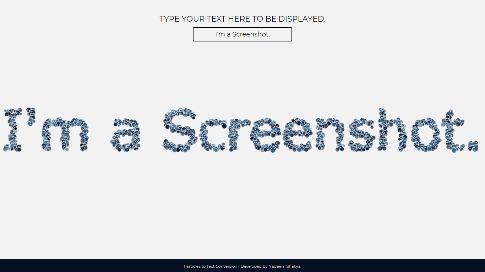

# Text-to-Point-to-Text-Conversion-Animation
Here I'll trying to create text using particles in the browser canvas using HTML 5 Canvas and JavaScript.

* An animation where Random bubbles come together to form the text you provided as an input.
* Object interaction with image data of the canvas.

### DEMO


### SCREENSHOT



## Computing x and y pixel position on the basis of the RGBA values.

* Get the Linear Position of the pixel depending on the alpha value. <br/> 
```javascript
        let linearPosition = alphaIndex / 4;
```
* Divide the linearPosition by the width to get the Y Co-ordinate.
```javascript
        let y = Math.floor(linearPosition / canvas.width);
```
* Multiply the y co-ordinate by the width and substract the whole value from the LinearPosition to get the X Co-ordinate.
```javascript
        let x = linearPosition - (Math.floor(linearPosition / canvas.width) * canvas.width);
```
<hr>
<p align="center">
  Made By Ayush Jain with ❤️
  </p>
  

